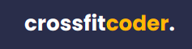

<h1 align= "center">

</h1>

  <a href="#-tecnologies">Project</a>&nbsp;&nbsp;&nbsp;|&nbsp;&nbsp;&nbsp;
  <a href="#-project">Tecnologies</a>&nbsp;&nbsp;&nbsp;|&nbsp;&nbsp;&nbsp;
  <a href="#-layout">Layout</a>

 

<h1>

## 💻 Project

Crossfitcoder é um pagina em formato de landing page totalmente customizavel e responsiva para desktops, smartphones e tablets. Site tem a funcionalidade de agendamento de horário, conexão para conversar com a empresa via whatsapp e link de redes sociais.

Projeto feito durante a NLW6 - Trilha Origin da RocketSeat que me mostrou muitas coisas novas de Front-End e assim poder comecar a utilizar para projetos e trabalhos futuros.

<h1>

## 🚀 Tecnologies

 

 

 

---

## 🔖Layout

link: https://jaquelinepires.github.io/crossfitcoder/

---

Feito com ♥ by Jaqueline Pires
